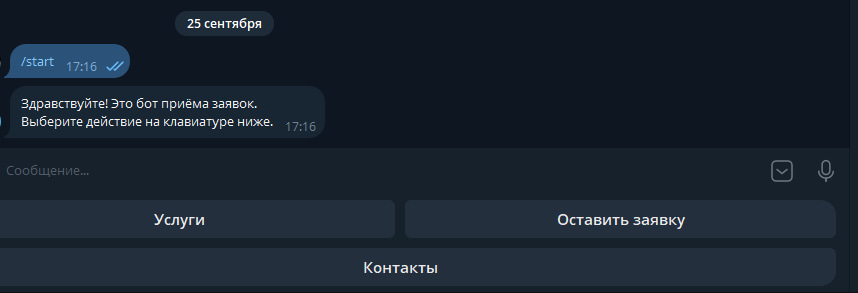
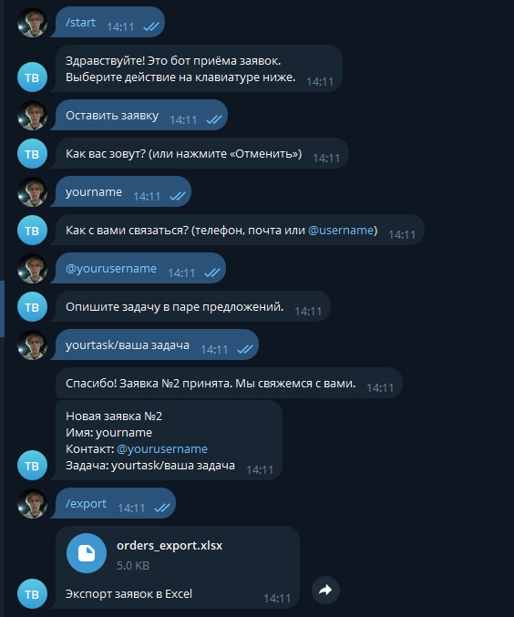
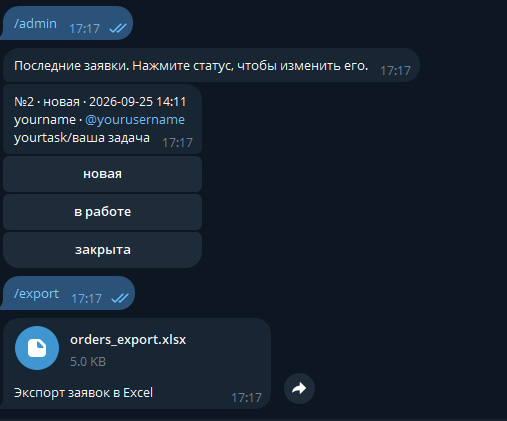
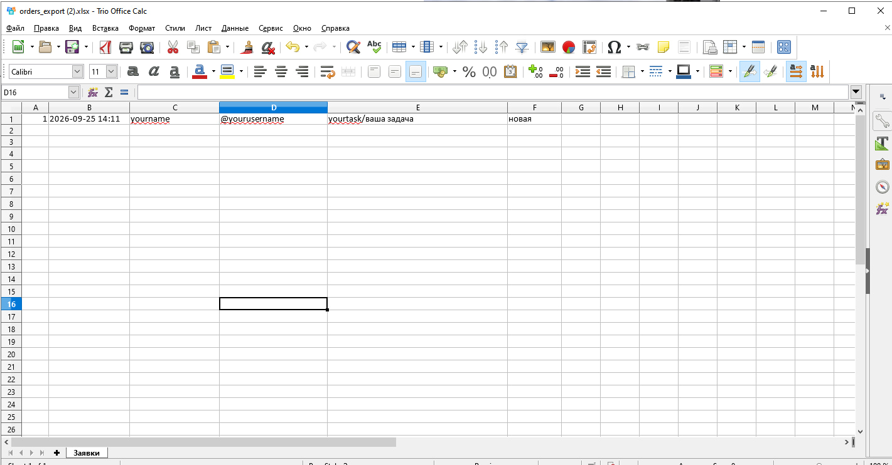

# tg-orders-bot — Telegram-бот для приёма заявок

Бот для малого бизнеса: клиент открывает меню на кнопках, оставляет заявку по шагам, а заявка сохраняется в базу и приходит администратору уведомлением.

Это проект для портфолио на фриланс-биржах. Самый частый заказ у мастеров, салонов, репетиторов и сервисов — «нужен бот, чтобы принимал заявки».

## Как это выглядит

Меню с кнопками:



Заполнение заявки по шагам и подтверждение приёма:



Админка: заявки и смена статуса кнопками:



Экспорт заявок в файл Excel:



## Что умеет

- меню на кнопках: «Услуги», «Оставить заявку», «Контакты»;
- пошаговый приём заявки (имя → контакт → описание задачи) с проверкой ввода;
- кнопка «Отменить» на любом шаге заполнения;
- сохранение заявок в базу SQLite;
- уведомление администратору о новой заявке;
- команда `/admin` — просмотр последних заявок и смена статуса кнопками;
- команда `/export` — выгрузка всех заявок в файл Excel.

## Установка

Нужен Python 3.10+.

```bash
# 1. Виртуальное окружение
py -3.13 -m venv .venv
.venv\Scripts\activate

# 2. Зависимости
pip install -r requirements.txt
```

## Настройка бота

1. Открой в Telegram бота **@BotFather**, отправь `/newbot`.
2. Придумай имя и username бота (username должен заканчиваться на `bot`).
3. BotFather выдаст **токен** — длинную строку вида `123456:ABC...`.
4. Скопируй файл `.env.example` в `.env` и впиши туда токен.
5. Свой id для `ADMIN_IDS` можно узнать у бота **@userinfobot**.

Файл `.env` выглядит так:

```
BOT_TOKEN=123456789:AAAAAAAAAAAAAAAAAAAAAAAAAAAAAAAAAAA
ADMIN_IDS=123456789
```

> `.env` уже добавлен в `.gitignore`. Никогда не заливай токен на GitHub — иначе бота угонят.

## Команды администратора

| Команда | Что делает |
|---|---|
| `/admin` | Показывает последние заявки. Под каждой — кнопки смены статуса (`новая` → `в работе` → `закрыта`). |
| `/export` | Присылает файл `orders_export.xlsx` со всеми заявками. |

Команды доступны только тем id, что указаны в `ADMIN_IDS`.

## Запуск

```bash
python bot.py
```

В консоли появится «Бот запущен». Открой своего бота в Telegram и нажми «Start».

## Тесты

```bash
python -m unittest -v
```

Тесты проверяют работу с базой заявок — они не требуют токена и интернета.

## Структура проекта

```
tg-orders-bot/
├── bot.py            # точка входа: запуск бота
├── handlers.py       # обработчики кнопок и шагов заявки
├── keyboards.py      # меню на кнопках
├── storage.py        # работа с базой SQLite
├── export.py         # выгрузка заявок в Excel
├── config.py         # чтение токена и настроек
├── test_storage.py   # тесты базы
├── test_export.py    # тесты экспорта
├── .env.example      # образец настроек (без реального токена)
└── requirements.txt
```

## Как показывать в портфолио

- **Живой бот** — самая сильная демонстрация. Дай ссылку прямо в отклике.
- **Скриншоты диалога** — приложи в README: меню, заполнение заявки, уведомление админу.
- **Короткое видео** (10–15 секунд) — как клиент оставляет заявку.
- **Описание на языке заказчика:** не «я сделал бота», а «бот принимает заявки 24/7, вы получаете их мгновенно».

## Запуск круглосуточно (деплой)

Чтобы бот работал 24/7 и не зависел от компьютера, его можно разместить на сервере (Ubuntu) или на платформе, которая собирает проект из GitHub (Railway, Koyeb). В проекте есть `Dockerfile`, поэтому PaaS-деплой почти не требует настройки, а секреты задаются переменными окружения. Готовые файлы — в папке [`deploy/`](deploy/):

- [`deploy/install.sh`](deploy/install.sh) — установка одной командой;
- [`deploy/tg-orders-bot.service`](deploy/tg-orders-bot.service) — автозапуск (systemd);
- [`deploy/README.md`](deploy/README.md) — краткие шаги.

Коротко:

```bash
git clone https://github.com/666usr/tg-orders-bot.git
cd tg-orders-bot
nano .env            # впиши BOT_TOKEN и ADMIN_IDS
bash deploy/install.sh
```

После этого бот поднимается сам при перезагрузке сервера и перезапускается при сбоях.

## Что можно улучшить

- Разделение услуг по категориям с ценами.
- Напоминание админу о заявках, на которые давно не отвечали.
- Простая аналитика: сколько заявок пришло за неделю.
- Деплой на сервер, чтобы бот работал круглосуточно.

## Лицензия

Учебный проект для портфолио. Используй свободно.
